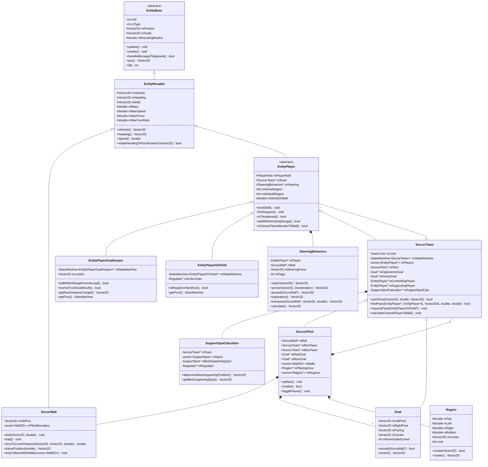
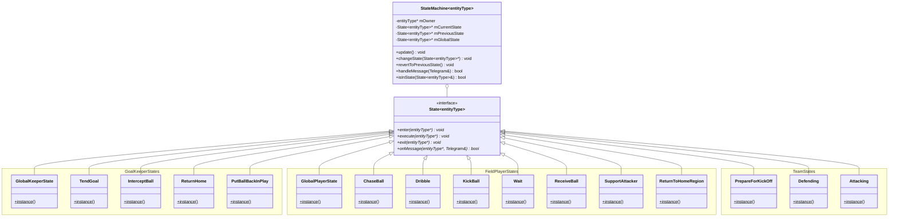
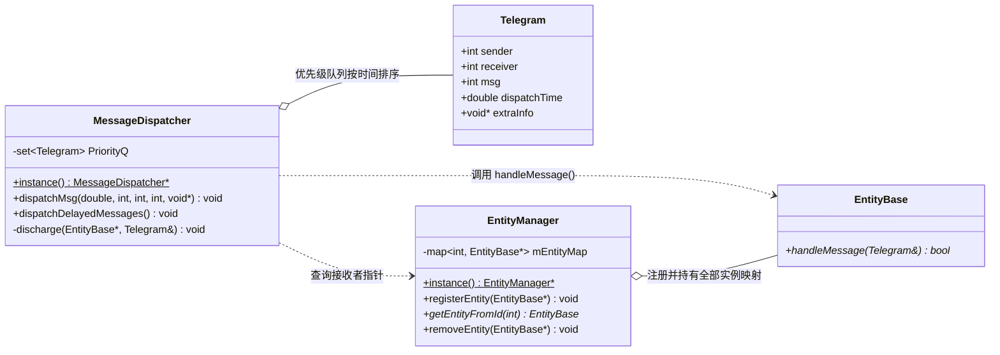
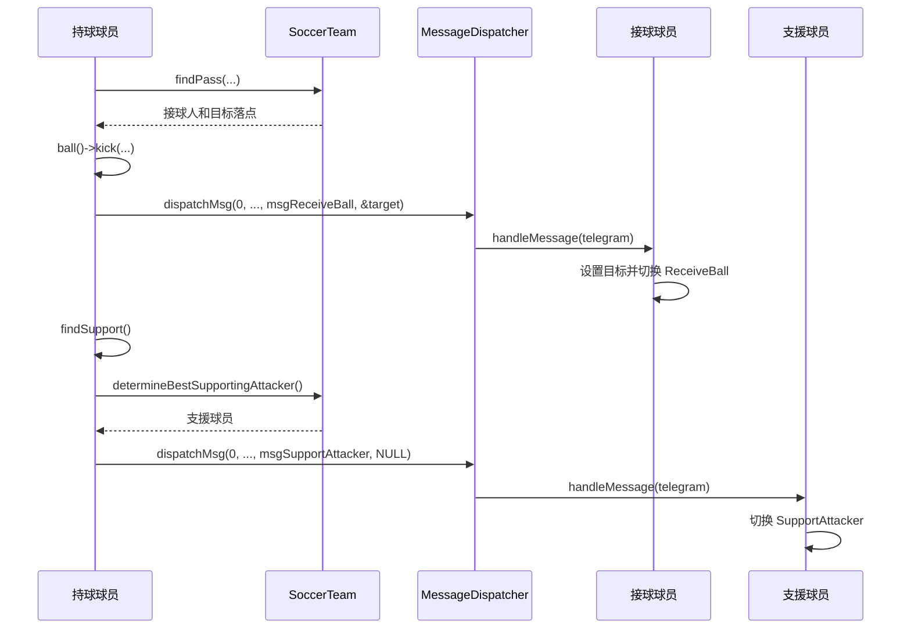

# SimpleSoccer 架构与详细设计文档 (DESIGN.md)

本文档系统性剖析 SimpleSoccer（基于有限状态机与操纵行为的足球 AI 仿真系统）的软件架构、核心设计模式、数学物理模型与智能体协同机制。

---

## 目录

1. [架构总览与分层设计](#1-架构总览与分层设计)
2. [类图设计 (UML Class Diagrams)](#2-类图设计-uml-class-diagrams)
   - [2.1 核心领域模型类图](#21-核心领域模型类图)
   - [2.2 有限状态机 (FSM) 类图](#22-有限状态机-fsm-类图)
   - [2.3 消息通信与实体管理类图](#23-消息通信与实体管理类图)
3. [有限状态机体系与流转逻辑](#3-有限状态机体系与流转逻辑)
   - [3.1 泛型 FSM 框架设计](#31-泛型-fsm-框架设计)
   - [3.2 守门员状态机 (GoalKeeper FSM)](#32-守门员状态机-goalkeeper-fsm)
   - [3.3 场上球员状态机 (FieldPlayer FSM)](#33-场上球员状态机-fieldplayer-fsm)
   - [3.4 球队战术状态机 (team FSM)](#34-球队战术状态机-team-fsm)
4. [自主智能体操纵行为 (Steering Behaviors)](#4-自主智能体操纵行为-steering-behaviors)
   - [4.1 操纵力计算与截断叠加机制](#41-操纵力计算与截断叠加机制)
   - [4.2 核心操纵行为算法](#42-核心操纵行为算法)
5. [消息驱动通信体系 (Message-Driven Architecture)](#5-消息驱动通信体系-message-driven-architecture)
   - [5.1 消息载体与派发机制](#51-消息载体与派发机制)
   - [5.2 核心业务消息流转时序](#52-核心业务消息流转时序)
6. [战术决策与几何计算模型](#6-战术决策与几何计算模型)
   - [6.1 跑位支援点评估模型 (`SupportSpotCalculator`)](#61-跑位支援点评估模型-supportspotcalculator)
   - [6.2 传球安全度与拦截判定](#62-传球安全度与拦截判定)
   - [6.3 射门路线与进球判定](#63-射门路线与进球判定)
7. [物理运动与轨迹预估模型](#7-物理运动与轨迹预估模型)
8. [设计模式综合总结](#8-设计模式综合总结)
9. [实际依赖、对象生命周期与维护建议](#9-实际依赖对象生命周期与维护建议)

---

## 1. 架构总览与分层设计

SimpleSoccer 采用了经典面向对象游戏架构，可按职责理解为以下层次。该图表达业务组织关系，不代表单向模块依赖：

```text
+-------------------------------------------------------------+
|                表现层与控制层 (Presentation & Main)           |
|            main.cpp (Win32 WndProc, GDI, PrecisionTimer)     |
+-------------------------------------------------------------+
                              |
+-------------------------------------------------------------+
|                世界与比赛调度层 (Simulation World)             |
|              SoccerPitch, Goal, Region, Wall2D              |
+-------------------------------------------------------------+
         |                                          |
+-----------------------------+   +---------------------------+
|    球队协同层 (team Layer)    |   | 消息与管理层 (Core Infra)  |
| SoccerTeam, SupportSpotCalc |   | MessageDispatcher,        |
+-----------------------------+   | EntityManager, Telegram   |
         |                        +---------------------------+
+-------------------------------------------------------------+
|               实体与智能体决策层 (Agent & FSM Layer)           |
|  EntityPlayer, EntityPlayerGoalKeeper, EntityPlayerOnField, |
|  StateMachine<T>, State<T>, SteeringBehaviors, SoccerBall   |
+-------------------------------------------------------------+
                              |
+-------------------------------------------------------------+
|               基础数学与工具层 (Math & Geometry Utility)       |
|  Vector2D, C2DMatrix, Geometry, ParamLoader, Cgdi, Utils    |
+-------------------------------------------------------------+
```

1. **基础数学与工具层**：提供 [`Vector2D`](./math/Vector2D.h) 二维向量运算、[`C2DMatrix`](./math/C2DMatrix.h) 仿射变换、[`geometry.h`](./math/geometry.h) 几何相交算法、GDI 渲染封装与 INI 参数解析。
2. **实体与智能体层**：基于 [`EntityBase`](./entity/EntityBase.h) 和 [`EntityMovable`](./entity/EntityMovable.h) 派生球员与足球，将智能体的运动力学与状态决策解耦。
3. **球队协同层**：[`SoccerTeam`](./game/SoccerTeam.h) 维护全局持球者、接球者、支援者，并调用 [`SupportSpotCalculator`](./game/SupportSpotCalculator.h) 计算最佳战术点。
4. **世界管理层**：[`SoccerPitch`](./game/SoccerPitch.h) 统领场地物理边界、两支球队、足球和球门。
5. **消息基础设施**：通过单例 [`MessageDispatcher`](./messaging/MessageDispatcher.h) 解除智能体间的直接强关联。

---

## 2. 类图设计 (UML Class Diagrams)

### 2.1 核心领域模型类图



---

### 2.2 有限状态机 (FSM) 类图

系统利用泛型 `State<entityType>` 抽象接口与 `StateMachine<entityType>` 容器驱动状态生命周期，具体状态类全部为 **单例模式**：



---

### 2.3 消息通信与实体管理类图



---

## 3. 有限状态机体系与流转逻辑

### 3.1 泛型 FSM 框架设计

在 [`StateMachine.h`](./fsm/StateMachine.h) 中，状态机保存以下三种状态指针。它们不是三层嵌套状态；球队和球员分别运行自己的 FSM，没有父子状态机制：
- **`mCurrentState`**：当前主要执行的状态。
- **`mPreviousState`**：前一个状态（支持 `revertToPreviousState()` 回溯）。
- **`mGlobalState`**：全局状态。在每一帧的 `update()` 中，先执行全局状态的 `execute`，再执行当时的当前状态；在收到消息时，若当前状态未处理该消息，自动冒泡转交至全局状态处理。

```cpp
void update() const {
    if (mGlobalState)  mGlobalState->execute(mOwner);
    if (mCurrentState) mCurrentState->execute(mOwner);
}
```

---

### 3.2 守门员状态机 (GoalKeeper FSM)

守门员持有 [`StateMachine<EntityPlayerGoalKeeper>`](./entity/EntityPlayerGoalkeeper.h)，各状态定义于 [`StatesPlayerGoalKeeper.h`](./fsm/StatesPlayerGoalKeeper.h)：

```mermaid
stateDiagram-v2
    [*] --> TendGoal: 比赛开始 / 默认状态

    state TendGoal {
        description: 站在球门线上插足(interpose)跟随足球移动
    }
    state InterceptBall {
        description: 出击冲向皮球进行拦截
    }
    state PutBallBackInPlay {
        description: 控球后停下并传给队友
    }
    state ReturnHome {
        description: 失去控球或威胁解除后返回门线原位
    }

    TendGoal --> InterceptBall: 球进入禁区/拦截半径 (ballWithinRangeForIntercept)
    TendGoal --> ReturnHome: 偏离球门口过远 (tooFarFromGoalMouth)

    InterceptBall --> PutBallBackInPlay: 成功截获皮球 (ballWithinKeeperRange)
    InterceptBall --> ReturnHome: 距离门线过远或对手已失去威胁

    PutBallBackInPlay --> TendGoal: 成功将球传出 (findPass)

    ReturnHome --> TendGoal: 到达大门中央原位 (atTarget)
```

- **`GlobalKeeperState`**：守门员全局状态，拦截并响应外部传球指令。
- **`TendGoal`**：守门员在球门底线和球之间维持一定插足距离（`interpose` 操纵行为），时刻注视足球。
- **`InterceptBall`**：当球进入拦截范围（`entityPlayerGoalKeeperInterceptRange`）且本方未完全控球时触发，施加 `pursuit` 冲力。
- **`PutBallBackInPlay`**：门将抱住球后呼叫全队回位，扫描视野并向最佳安全位置的队友传出地面球。

---

### 3.3 场上球员状态机 (FieldPlayer FSM)

场上球员持有 [`StateMachine<EntityPlayerOnField>`](./entity/EntityPlayerOnField.h)，各状态定义于 [`StatesPlayerOnField.h`](./fsm/StatesPlayerOnField.h)：

```mermaid
stateDiagram-v2
    [*] --> Wait

    state Wait {
        description: 原地待命，面向球
    }
    state ChaseBall {
        description: 全速冲向足球
    }
    state Dribble {
        description: 小力趟球盘带向前
    }
    state KickBall {
        description: 决策射门或传球
    }
    state ReceiveBall {
        description: 跑向传球接应点
    }
    state SupportAttacker {
        description: 跑位到最佳支援点接应
    }
    state ReturnToHomeRegion {
        description: 回防到初始所属区域
    }

    Wait --> ChaseBall: 成为全队离球最近的队员
    Wait --> SupportAttacker: 收到 msgSupportAttacker
    Wait --> ReceiveBall: 收到 msgReceiveBall

    ChaseBall --> KickBall: 进入起脚范围 (ballWithinKickingRange)
    ChaseBall --> ReturnToHomeRegion: 不再是最近球员，且本队失去控球

    KickBall --> Dribble: 无法射门且无安全传球路线
    KickBall --> Wait: 成功踢出射门或传球

    Dribble --> KickBall: 重新进入起脚准备周期或遇到对手封堵
    Dribble --> ChaseBall: 趟球距离变大脱离脚下

    ReceiveBall --> ChaseBall: 球接近至接应阈值内
    ReceiveBall --> Wait: 传球被断或超出接收范围

    SupportAttacker --> Wait: 队友已传出球或射门
    SupportAttacker --> ChaseBall: 自身变为离球最近队员

    ReturnToHomeRegion --> Wait: 回到 homeRegion 指定范围内
    ReturnToHomeRegion --> ChaseBall: 途中变成离球最近队员
```

- **`GlobalPlayerState`**：每一帧更新球员到皮球的距离平方缓存，并在收到外部消息（如 `msgReceiveBall`、`msgSupportAttacker`、`msgGoHome`）时代为分发处理。
- **`KickBall`**：决策中枢，执行三级决策树：
  1. 能射门则射门（[`SoccerTeam::canShoot`](./game/SoccerTeam.h)）；
  2. 寻找最安全且向前推进的队友传球（[`SoccerTeam::findPass`](./game/SoccerTeam.h)）；
  3. 若均不可行，切换至 [`Dribble`](./fsm/StatesPlayerOnField.h) 缓慢带球推进。

---

### 3.4 球队战术状态机 (team FSM)

球队持有 [`StateMachine<SoccerTeam>`](./game/SoccerTeam.h)，各状态定义于 [`StatesTeam.h`](./fsm/StatesTeam.h)：

```mermaid
stateDiagram-v2
    [*] --> PrepareForKickOff: 开赛初始化

    state PrepareForKickOff {
        description: 全员返回开球初始站位
    }
    state Defending {
        description: 失去控球权，就近盯防与回撤
    }
    state Attacking {
        description: 获得控球权，全队前压并跑位接应
    }

    PrepareForKickOff --> Defending: 开球完成 (所有球员到位且比赛开始)
    Defending --> Attacking: 本队任意球员控制皮球 (isControllingPlayer)
    Attacking --> Defending: 对手抢断或失去控球权
    Attacking --> PrepareForKickOff: 进球 (Goal::scored)
    Defending --> PrepareForKickOff: 被进球
```

- **`PrepareForKickOff`**：命令所有球员回到 `mDefaultRegion`，重置关键指针（持球人、支援人均清空）。
- **`Defending`**：指定最近球员前去逼抢（`ChaseBall`），其余球员进入 `ReturnToHomeRegion` 或就近盯防。
- **`Attacking`**：确定持球人（`controllingPlayer`），命令距最佳支援点最近的无球球员切换到 `SupportAttacker`，其余球员依据网格分布接应。

---

## 4. 自主智能体操纵行为 (Steering Behaviors)

操纵行为类 [`SteeringBehaviors`](./game/SteeringBehaviors.h) 负责输出二维加速度合力向量 $\mathbf{F}_{steering}$，直接驱动 [`EntityMovable`](./entity/EntityMovable.h) 的速度与朝向更新。

### 4.1 操纵力计算与截断叠加机制

每个球员同时可能激活多个行为标志位（如 `separationBehavior` + `arriveBehavior`）。系统通过优先累加机制 [`accumulateForce`](./game/SteeringBehaviors.h) 防止合力超过球员的最大推力（`mMaxForce`）：

$$\mathbf{F}_{remain} = F_{max} - |\mathbf{F}_{total}|$$

当新的子行为力大小超过剩余可用量时，进行向量截断：

$$\mathbf{F}_{total} \leftarrow \mathbf{F}_{total} + \frac{\mathbf{F}_{add}}{|\mathbf{F}_{add}|} \cdot \mathbf{F}_{remain}$$

---

### 4.2 核心操纵行为算法

1. **寻找 (seek)**
   $$\mathbf{v}_{desired} = \text{normalize}(\mathbf{x}_{target} - \mathbf{x}) \cdot v_{max}$$
   $$\mathbf{F}_{seekBehavior} = \mathbf{v}_{desired} - \mathbf{v}$$

2. **到达 (arrive)**
   带有减速因子的平滑进站。当距目标距离 $d$ 较小时线性衰减期望速度：
   $$v_{speed} = \min\left(v_{max},\, \frac{d}{\text{Deceleration} \cdot \tau}\right)$$
   $$\mathbf{v}_{desired} = \frac{\mathbf{x}_{target} - \mathbf{x}}{d} \cdot v_{speed}$$

3. **追击 / 拦截 (pursuit)**
   用于球员追赶运动中的足球。根据球的当前速度预估相遇时间 $t_{lookahead}$，并 seek 该未来预测点：
   $$t_{lookahead} = \frac{|\mathbf{x}_{ball} - \mathbf{x}|}{v_{max} + v_{ball}}$$
   $$\mathbf{x}_{future} = \mathbf{x}_{ball} + \mathbf{v}_{ball} \cdot t_{lookahead}$$

4. **队员分离 (separation)**
   遍历视野范围内的所有队友，产生反向排斥力，防止多名球员抢球时堆叠：
   $$\mathbf{F}_{sep} = \sum_{j \in \text{neighbors}} \frac{\mathbf{x} - \mathbf{x}_j}{|\mathbf{x} - \mathbf{x}_j|^2}$$

5. **插足卡位 (interpose)**
   用于守门员防守或防守球员盯人。操纵球员停在目标 A（球）与目标 B（球门中心或接球人）连线上的指定中途点。

---

## 5. 消息驱动通信体系 (Message-Driven Architecture)

### 5.1 消息载体与派发机制

实体间通过 [`Telegram`](./messaging/Telegram.h) 传递消息。当前比赛使用同步即时投递，接收者的处理函数在发送调用返回前执行：

```cpp
struct Telegram {
    int    sender;        // 发送方实体 id
    int    receiver;      // 接收方实体 id
    int    msg;           // 消息枚举 (如 msgPassToMe)
    double dispatchTime;  // 期望派发帧计数（不是秒）
    void*  extraInfo;     // 附加数据指针 (如目标落点 Vector2D*)
};
```

- **即时消息 (`delay <= 0`)**：由 [`MessageDispatcher::dispatchMsg`](./messaging/MessageDispatcher.h) 查表并直接调用目标实体的 `handleMessage()`。
- **延时消息 (`delay > 0`)**：压入 `std::set<Telegram>`（以时间为权值的优先队列）。`dispatchDelayedMessages()` 按帧计数检查到期消息，但当前主循环没有调用此方法，也没有推进 `FrameCounter`，因此延迟投递尚未接入比赛。

---

### 5.2 核心业务消息流转时序

#### 传球场景协作时序图



消息中的 `extraInfo` 是无所有权的 `void*`。当前传球目标可通过即时投递在调用期间读取；如果改成延迟投递，需要让载荷拥有足够长的生命周期，不能直接缓存局部变量地址。

---

## 6. 战术决策与几何计算模型

### 6.1 跑位支援点评估模型 (`SupportSpotCalculator`)

在 [`SupportSpotCalculator.h`](./game/SupportSpotCalculator.h) 中，场地被剖分为二维网格点集。定时计算器在每一周期遍历所有点 $S_i$，多维度打分：

$$\text{Score}(S_i) = 1 + w_1 \cdot C_{pass}(S_i) + w_2 \cdot C_{score}(S_i) + w_3 \cdot D_{optimal}(S_i)$$

1. **传球可行度 $C_{pass}$**：测试从当前持球球员位置向 $S_i$ 传球是否会被任意对方防守队员拦截。
2. **射门得分威胁度 $C_{score}$**：测试如果球员站在 $S_i$，是否能够直接起脚打入对方球门且不受门将/后卫阻挡。
3. **距离奖励项 $D_{optimal}$**：仅在已有支援球员时计算，以距持球者 200 像素为最佳距离，在 0 到 400 像素之间给予三角形分布的额外奖励；不直接扣分。配置中另两个支援权重虽被读取，但没有参与当前评分。

最高分的点被选为 `mBestSupportingSpot`，通过消息通知无球跑位球员前往接应。

---

### 6.2 传球安全度与拦截判定

在 [`SoccerTeam::isPassSafeFromOpponent`](./game/SoccerTeam.cpp) 中，先把对手位置转换到以传球方向为 X 轴的局部坐标：

1. 对手位于传球起点后方时直接认为安全，这是基于球速高于对手最大速度的简化假设。
2. 对手距起点比目标更远时，依据是否有接球者及双方距目标的距离判断。
3. 对其他情况，估算球到对手在传球轴上投影位置的时间 `timeForBall`。
4. 计算对手可达范围 `reach = maxSpeed * timeForBall + 球半径 + 对手半径`。
5. 若对手到传球轴的垂直距离小于 `reach`，则判定不安全。

该实现使用局部坐标与可达范围估算，没有额外的时间安全裕量参数，也不模拟完整拦截轨迹。

---

### 6.3 射门路线与进球判定

- **进球判定**：[`Goal::scored`](./game/Goal.h) 使用二维线段相交算法：
  $$\text{lineIntersection2D}(\mathbf{x}_{ball}^{now},\, \mathbf{x}_{ball}^{old},\, \mathbf{P}_{left}^{post},\, \mathbf{P}_{right}^{post})$$
  若球在上一帧与当前帧的位移线段与两门柱之间的线段相交，计入进球。当前 `Goal::scored()` 没有额外检查运动方向。

---

## 7. 物理运动与轨迹预估模型

在 [`SoccerBall.h`](./game/SoccerBall.h) 中，足球受草坪恒定摩擦阻力做减速运动：

每次固定步长更新，代码沿速度方向叠加 `prm.friction`，再以更新后的速度推进位置；`friction = -0.015` 是模拟步长中的速度变化量，没有使用物理摩擦系数乘重力的计算。

### 1. 距离飞行时间反算 (`timeToCoverDistance`)
根据初速度 $v_0$、位移 $s$ 与减速度 $a$：
$$s = v_0 \cdot t + \frac{1}{2} a \cdot t^2$$
使用恒定减速度模型估算传球到达时间；不可到达时返回 `-1.0`。该预测用于战术判断，不是逐帧运动与碰撞的精确重放。

### 2. 未来位置推演 (`futurePosition`)
$$\mathbf{x}(t) = \mathbf{x}_0 + \mathbf{v}_0 \cdot t + \frac{1}{2} \mathbf{a} \cdot t^2$$
`futurePosition()` 直接计算上述公式，没有将预测时间截断到停止时刻，也不预测墙壁反弹。预测时间超过停止时刻时，可能得到不符合实际运动的结果。

---

## 8. 设计模式综合总结

| 设计模式 | 对应实现类 | 应用意图与收益 |
| :--- | :--- | :--- |
| **状态模式 (State Pattern)** | [`State<T>`](./fsm/State.h), [`StateMachine<T>`](./fsm/StateMachine.h) | 消除庞大的嵌套 `switch-case`，将球员和球队的各项行为封装为独立自治类，新增动作无须修改主体框架。 |
| **单例模式 (Singleton Pattern)** | 所有具体状态子类、[`MessageDispatcher`](./messaging/MessageDispatcher.h)、[`EntityManager`](./entity/EntityManager.h) | 状态类均无成员变量（无自身状态），全局仅需一个单例共享实例，节约堆栈开销；消息与实体管理器全局唯一。 |
| **中介者模式 (Mediator Pattern)** | [`MessageDispatcher`](./messaging/MessageDispatcher.h) | 传球请求、接球、支援与回位通知经调度器中转；球队仍直接保存球员指针，消息机制不消除所有对象耦合。 |
| **策略模式 (Strategy Pattern)** | [`SteeringBehaviors`](./game/SteeringBehaviors.h) | 将寻找、到达、追击、拦截等运动算法抽离为可自由启用的插拔策略组合。 |
| **模板方法 / 接口模式** | [`EntityBase`](./entity/EntityBase.h) | 统一规定实体的 `update()`, `render()`, `handleMessage()` 虚函数契约，球队通过球员基类指针调用具体角色；主循环直接调用 SoccerPitch，未统一遍历所有实体。 |

## 9. 实际依赖、对象生命周期与维护建议

### 9.1 模块边界与更新顺序

| 模块 | 当前依赖与职责边界 |
| :--- | :--- |
| `fsm/` | `State.h`、`StateMachine.h` 是通用模板；同目录的足球状态直接调用球队、球员、场地和消息设施。 |
| `entity/` | 通用实体与足球球员共存；球员依赖 `game/` 的球队、足球和 steering，业务依赖与 `fsm/`、`game/` 双向交织。 |
| `game/` | 世界、球队、战术、物理与渲染共存；`SoccerTeam` 还负责球员创建及注册。 |
| `messaging/` | 调度器依赖全局实体注册表与帧计数器；接收者通过虚函数处理消息。 |
| `math/`、`common/` | `Vector2D` 使用 Win32 类型，`Region`、`Wall2D` 内置 GDI 绘图；基础层尚不能独立于窗口环境使用。 |
| `graph/` | 包含通用搜索模板及依赖窗口、工具栏的 Pathfinder 演示类。足球逻辑没有引用 Pathfinder，但 Makefile 编译它，main.cpp 为它保留工具栏全局变量。 |

每次定时更新依次调用 `SoccerPitch::update()` → 足球更新 → 红队更新 → 蓝队更新 → 进球检测。球队先计算最近球员，再更新球队 FSM，最后依次更新各球员；球员先执行 FSM，再计算移动。暂停时场地更新直接返回。绘图由 Win32 的 `WM_PAINT` 驱动，与更新入口分开，但各业务对象内部仍实现 `render()`。

模拟使用固定步长，没有向 `update()` 传入 elapsed time；改变更新频率会影响实际时间中的运动速度。支援点评估和踢球频率另外使用 `Regulator` 限频。

### 9.2 对象所有权与生命周期

- `main.cpp` 创建并删除 `SoccerPitch`；按 `R` 删除旧场地并创建新场地。
- 场地拥有足球、两支球队、两个球门、场地区域和分区对象；球队拥有球员、球队 FSM 和支援点计算器。
- 球员拥有 steering，具体角色拥有各自 FSM；场上球员另外拥有踢球频率调节器。状态对象采用共享单例，不由 FSM 删除。
- 球队与球员之间、球队与场地之间，以及对手引用等使用非拥有的裸指针。拥有关系同样用裸指针表达，缺少异常情况下的自动清理。
- `EntityManager` 保存球员指针但不拥有球员。当前球队销毁球员时没有调用 `removeEntity()`，重置也没有清空注册表，旧条目会成为悬空指针。
- `getEntityFromId()` 对不存在的 id 使用断言，未提供安全的失败返回；因此调度器里的空指针检查不能覆盖无效 id 情况。

### 9.3 尚未完成的消息与构建支持

延迟消息依赖 `FrameCounter`，当前没有接入帧计数更新与延迟派发。`Telegram::operator<` 主要按派发时间比较，不同消息具有相同时间时会被 `std::set` 视为等价；时间容差参与比较也不能保证严格弱序。完善此机制时应使用可靠的排序规则、保留同一时间的多个消息，并管理载荷及接收者的生命周期。

Makefile 没有生成和包含头文件依赖文件，修改头文件后可能复用旧对象。建议添加 `-MMD -MP` 及 `.d` 文件包含规则。当前对象路径通过 `notdir` 去掉源文件目录，未来增加同名源文件会冲突，应保留目录结构。仓库目前没有自动化测试与 CI 配置。

### 9.4 配置与文档使用约定

[Params.ini](./Params.ini) 从进程工作目录读取，由 `ParamLoader` 单例首次初始化时加载。解析器按条目顺序提取数值，不按键名查找；新增或重排配置项必须同步修改读取顺序。文件标签 `numSweetSpotsX/Y` 对应成员 `numSupportSpotsX/Y`，`spotCanPassScore` 对应 `spotPassSafeScore`。修改文件后需要重启程序，比赛重置不会重新读取。

本文的类图和状态图用于说明设计，运行行为以源码为准。所有源码链接采用仓库相对路径，避免依赖机器上的绝对目录。

### 9.5 建议改进顺序

1. 补全实体注册与注销，验证比赛重复重置后的查找和消息投递。
2. 修正消息队列排序、载荷所有权及无效接收者处理，再接入延迟调度和帧计数。
3. 完善头文件依赖与对象路径，隔离未使用的寻路演示代码。
4. 将通用 FSM 与足球状态分开，将 GDI 绘图移到独立渲染模块；逐步用 RAII 表达对象所有权。
5. 对实体生命周期、消息排序、FSM 切换和几何判定建立自动验证，再按需要引入 CI。

以上问题及建议来自静态代码核对；文档更新不表示这些改进已经实现，也不表示通过了编译或运行验证。
