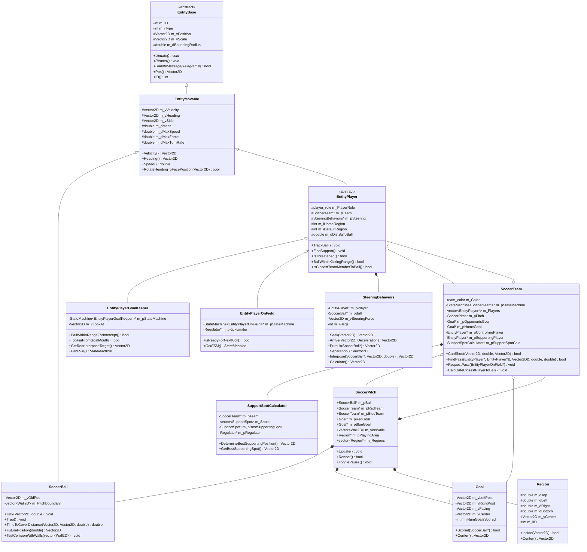
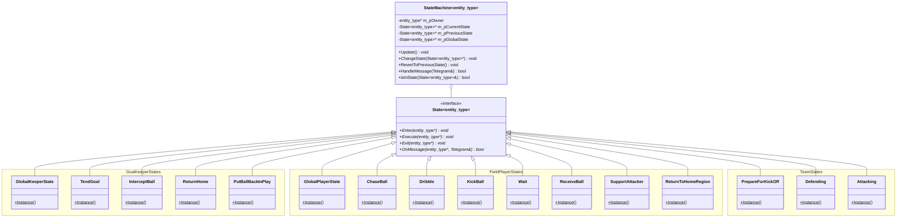
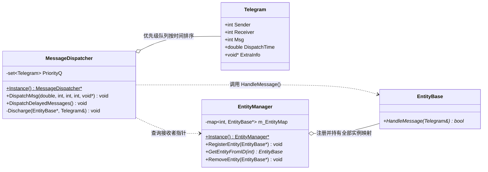
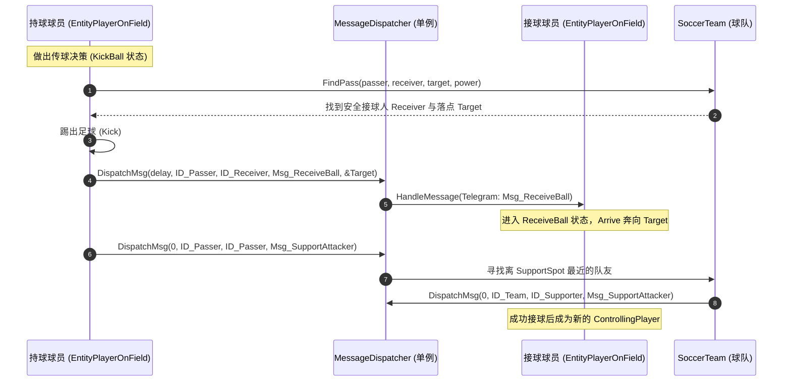

# SimpleSoccer 架构与详细设计文档 (DESIGN.md)

本文档系统性剖析 SimpleSoccer（基于有限状态机与操纵行为的足球 AI 仿真系统）的软件架构、核心设计模式、数学物理模型与智能体协同机制。

---

## 目录

1. [架构总览与分层设计](#1-架构总览与分层设计)
2. [类图设计 (UML Class Diagrams)](#2-类图设计-uml-class-diagrams)
   - [2.1 核心领域模型类图](#21-核心领域模型类图)
   - [2.2 有限状态机 (FSM) 类图](#22-有限状态机-fsm-类图)
   - [2.3 消息通信与实体管理类图](#23-消息通信与实体管理类图)
3. [有限状态机体系与流转逻辑](#3-有限状态机体系与流转逻辑)
   - [3.1 泛型 FSM 框架设计](#31-泛型-fsm-框架设计)
   - [3.2 守门员状态机 (GoalKeeper FSM)](#32-守门员状态机-goalkeeper-fsm)
   - [3.3 场上球员状态机 (FieldPlayer FSM)](#33-场上球员状态机-fieldplayer-fsm)
   - [3.4 球队战术状态机 (Team FSM)](#34-球队战术状态机-team-fsm)
4. [自主智能体操纵行为 (Steering Behaviors)](#4-自主智能体操纵行为-steering-behaviors)
   - [4.1 操纵力计算与截断叠加机制](#41-操纵力计算与截断叠加机制)
   - [4.2 核心操纵行为算法](#42-核心操纵行为算法)
5. [消息驱动通信体系 (Message-Driven Architecture)](#5-消息驱动通信体系-message-driven-architecture)
   - [5.1 消息载体与派发机制](#51-消息载体与派发机制)
   - [5.2 核心业务消息流转时序](#52-核心业务消息流转时序)
6. [战术决策与几何计算模型](#6-战术决策与几何计算模型)
   - [6.1 跑位支援点评估模型 (`SupportSpotCalculator`)](#61-跑位支援点评估模型-supportspotcalculator)
   - [6.2 传球安全度与拦截判定](#62-传球安全度与拦截判定)
   - [6.3 射门路线与进球判定](#63-射门路线与进球判定)
7. [物理运动与轨迹预估模型](#7-物理运动与轨迹预估模型)
8. [设计模式综合总结](#8-设计模式综合总结)

---

## 1. 架构总览与分层设计

SimpleSoccer 采用了经典面向对象游戏架构，整体划分为五大层次：

```text
+-------------------------------------------------------------+
|                表现层与控制层 (Presentation & Main)           |
|            main.cpp (Win32 WndProc, GDI, PrecisionTimer)     |
+-------------------------------------------------------------+
                              |
+-------------------------------------------------------------+
|                世界与比赛调度层 (Simulation World)             |
|              SoccerPitch, Goal, Region, Wall2D              |
+-------------------------------------------------------------+
         |                                          |
+-----------------------------+   +---------------------------+
|    球队协同层 (Team Layer)    |   | 消息与管理层 (Core Infra)  |
| SoccerTeam, SupportSpotCalc |   | MessageDispatcher,        |
+-----------------------------+   | EntityManager, Telegram   |
         |                        +---------------------------+
+-------------------------------------------------------------+
|               实体与智能体决策层 (Agent & FSM Layer)           |
|  EntityPlayer, EntityPlayerGoalKeeper, EntityPlayerOnField, |
|  StateMachine<T>, State<T>, SteeringBehaviors, SoccerBall   |
+-------------------------------------------------------------+
                              |
+-------------------------------------------------------------+
|               基础数学与工具层 (Math & Geometry Utility)       |
|  Vector2D, C2DMatrix, Geometry, ParamLoader, Cgdi, Utils    |
+-------------------------------------------------------------+
```

1. **基础数学与工具层**：提供 [`Vector2D`](file:///d:/Code/fsm/Vector2D.h#L24-L100) 二维向量运算、[`C2DMatrix`](file:///d:/Code/fsm/C2DMatrix.h#L18-L90) 仿射变换、[`geometry.h`](file:///d:/Code/fsm/geometry.h#L20-L120) 几何相交算法、GDI 渲染封装与 INI 参数解析。
2. **实体与智能体层**：基于 [`EntityBase`](file:///d:/Code/fsm/EntityBase.h#L16-L97) 和 [`EntityMovable`](file:///d:/Code/fsm/EntityMovable.h#L22-L100) 派生球员与足球，将智能体的运动力学与状态决策解耦。
3. **球队协同层**：[`SoccerTeam`](file:///d:/Code/fsm/SoccerTeam.h#L21-L140) 维护全局持球者、接球者、支援者，并调用 [`SupportSpotCalculator`](file:///d:/Code/fsm/SupportSpotCalculator.h#L21-L70) 计算最佳战术点。
4. **世界管理层**：[`SoccerPitch`](file:///d:/Code/fsm/SoccerPitch.h#L20-L95) 统领场地物理边界、两支球队、足球和球门。
5. **消息基础设施**：通过单例 [`MessageDispatcher`](file:///d:/Code/fsm/MessageDispatcher.h#L33-L67) 解除智能体间的直接强关联。

---

## 2. 类图设计 (UML Class Diagrams)

### 2.1 核心领域模型类图



---

### 2.2 有限状态机 (FSM) 类图

系统利用泛型 `State<entity_type>` 抽象接口与 `StateMachine<entity_type>` 容器驱动状态生命周期，具体状态类全部为 **单例模式**：



---

### 2.3 消息通信与实体管理类图



---

## 3. 有限状态机体系与流转逻辑

### 3.1 泛型 FSM 框架设计

在 [`StateMachine.h`](file:///d:/Code/fsm/StateMachine.h#L21-L120) 中，状态机支持三层状态结构：
- **`m_pCurrentState`**：当前主要执行的状态。
- **`m_pPreviousState`**：前一个状态（支持 `RevertToPreviousState()` 回溯）。
- **`m_pGlobalState`**：全局状态。在每一帧的 `Update()` 中，优先或叠加执行全局状态的 `Execute`；在收到消息时，若当前状态未处理该消息，自动冒泡转交至全局状态处理。

```cpp
void Update() const {
    if (m_pGlobalState)  m_pGlobalState->Execute(m_pOwner);
    if (m_pCurrentState) m_pCurrentState->Execute(m_pOwner);
}
```

---

### 3.2 守门员状态机 (GoalKeeper FSM)

守门员持有 [`StateMachine<EntityPlayerGoalKeeper>`](file:///d:/Code/fsm/EntityPlayerGoalkeeper.h#L24-L68)，各状态定义于 [`StatesPlayerGoalKeeper.h`](file:///d:/Code/fsm/StatesPlayerGoalKeeper.h#L13-L120)：

```mermaid
stateDiagram-v2
    [*] --> TendGoal: 比赛开始 / 默认状态

    state TendGoal {
        description: 站在球门线上插足(Interpose)跟随足球移动
    }
    state InterceptBall {
        description: 出击冲向皮球进行拦截
    }
    state PutBallBackInPlay {
        description: 控球后停下并传给队友
    }
    state ReturnHome {
        description: 失去控球或威胁解除后返回门线原位
    }

    TendGoal --> InterceptBall: 球进入禁区/拦截半径 (BallWithinRangeForIntercept)
    TendGoal --> ReturnHome: 偏离球门口过远 (TooFarFromGoalMouth)
    
    InterceptBall --> PutBallBackInPlay: 成功截获皮球 (BallWithinKeeperRange)
    InterceptBall --> ReturnHome: 距离门线过远或对手已失去威胁
    
    PutBallBackInPlay --> TendGoal: 成功将球传出 (FindPass)
    
    ReturnHome --> TendGoal: 到达大门中央原位 (AtTarget)
```

- **`GlobalKeeperState`**：守门员全局状态，拦截并响应外部传球指令。
- **`TendGoal`**：守门员在球门底线和球之间维持一定插足距离（`Interpose` 操纵行为），时刻注视足球。
- **`InterceptBall`**：当球进入拦截范围（`EntityPlayerGoalKeeperInterceptRange`）且本方未完全控球时触发，施加 `Pursuit` 冲力。
- **`PutBallBackInPlay`**：门将抱住球后呼叫全队回位，扫描视野并向最佳安全位置的队友传出地面球。

---

### 3.3 场上球员状态机 (FieldPlayer FSM)

场上球员持有 [`StateMachine<EntityPlayerOnField>`](file:///d:/Code/fsm/EntityPlayerOnField.h#L39-L68)，各状态定义于 [`StatesPlayerOnField.h`](file:///d:/Code/fsm/StatesPlayerOnField.h#L15-L185)：

```mermaid
stateDiagram-v2
    [*] --> Wait

    state Wait {
        description: 原地待命，面向球
    }
    state ChaseBall {
        description: 全速冲向足球
    }
    state Dribble {
        description: 小力趟球盘带向前
    }
    state KickBall {
        description: 决策射门或传球
    }
    state ReceiveBall {
        description: 跑向传球接应点
    }
    state SupportAttacker {
        description: 跑位到最佳支援点接应
    }
    state ReturnToHomeRegion {
        description: 回防到初始所属区域
    }

    Wait --> ChaseBall: 成为全队离球最近的队员
    Wait --> SupportAttacker: 收到 Msg_SupportAttacker
    Wait --> ReceiveBall: 收到 Msg_ReceiveBall

    ChaseBall --> KickBall: 进入起脚范围 (BallWithinKickingRange)
    ChaseBall --> ReturnToHomeRegion: 不再是最近球员，且本队失去控球

    KickBall --> Dribble: 无法射门且无安全传球路线
    KickBall --> Wait: 成功踢出射门或传球

    Dribble --> KickBall: 重新进入起脚准备周期或遇到对手封堵
    Dribble --> ChaseBall: 趟球距离变大脱离脚下

    ReceiveBall --> ChaseBall: 球接近至接应阈值内
    ReceiveBall --> Wait: 传球被断或超出接收范围

    SupportAttacker --> Wait: 队友已传出球或射门
    SupportAttacker --> ChaseBall: 自身变为离球最近队员

    ReturnToHomeRegion --> Wait: 回到 HomeRegion 指定范围内
    ReturnToHomeRegion --> ChaseBall: 途中变成离球最近队员
```

- **`GlobalPlayerState`**：每一帧更新球员到皮球的距离平方缓存，并在收到外部消息（如 `Msg_ReceiveBall`、`Msg_SupportAttacker`、`Msg_GoHome`）时代为分发处理。
- **`KickBall`**：决策中枢，执行三级决策树：
  1. 能射门则射门（[`SoccerTeam::CanShoot`](file:///d:/Code/fsm/SoccerTeam.h#L90-L92)）；
  2. 寻找最安全且向前推进的队友传球（[`SoccerTeam::FindPass`](file:///d:/Code/fsm/SoccerTeam.h#L99-L103)）；
  3. 若均不可行，切换至 [`Dribble`](file:///d:/Code/fsm/StatesPlayerOnField.h#L57-L75) 缓慢带球推进。

---

### 3.4 球队战术状态机 (Team FSM)

球队持有 [`StateMachine<SoccerTeam>`](file:///d:/Code/fsm/SoccerTeam.h#L30-L31)，各状态定义于 [`StatesTeam.h`](file:///d:/Code/fsm/StatesTeam.h#L16-L79)：

```mermaid
stateDiagram-v2
    [*] --> PrepareForKickOff: 开赛初始化

    state PrepareForKickOff {
        description: 全员返回开球初始站位
    }
    state Defending {
        description: 失去控球权，就近盯防与回撤
    }
    state Attacking {
        description: 获得控球权，全队前压并跑位接应
    }

    PrepareForKickOff --> Defending: 开球完成 (所有球员到位且比赛开始)
    Defending --> Attacking: 本队任意球员控制皮球 (isControllingPlayer)
    Attacking --> Defending: 对手抢断或失去控球权
    Attacking --> PrepareForKickOff: 进球 (Goal::Scored)
    Defending --> PrepareForKickOff: 被进球
```

- **`PrepareForKickOff`**：命令所有球员回到 `m_iDefaultRegion`，重置关键指针（持球人、支援人均清空）。
- **`Defending`**：指定最近球员前去逼抢（`ChaseBall`），其余球员进入 `ReturnToHomeRegion` 或就近盯防。
- **`Attacking`**：确定持球人（`ControllingPlayer`），命令距最佳支援点最近的无球球员切换到 `SupportAttacker`，其余球员依据网格分布接应。

---

## 4. 自主智能体操纵行为 (Steering Behaviors)

操纵行为类 [`SteeringBehaviors`](file:///d:/Code/fsm/SteeringBehaviors.h#L20-L100) 负责输出二维加速度合力向量 $\mathbf{F}_{steering}$，直接驱动 [`EntityMovable`](file:///d:/Code/fsm/EntityMovable.h#L22-L100) 的速度与朝向更新。

### 4.1 操纵力计算与截断叠加机制

每个球员同时可能激活多个行为标志位（如 `separation` + `arrive`）。系统通过优先累加机制 [`AccumulateForce`](file:///d:/Code/fsm/SteeringBehaviors.h#L93) 防止合力超过球员的最大推力（`m_dMaxForce`）：

$$\mathbf{F}_{remain} = F_{max} - |\mathbf{F}_{total}|$$

当新的子行为力大小超过剩余可用量时，进行向量截断：

$$\mathbf{F}_{total} \leftarrow \mathbf{F}_{total} + \frac{\mathbf{F}_{add}}{|\mathbf{F}_{add}|} \cdot \mathbf{F}_{remain}$$

---

### 4.2 核心操纵行为算法

1. **寻找 (Seek)**
   $$\mathbf{v}_{desired} = \text{normalize}(\mathbf{x}_{target} - \mathbf{x}) \cdot v_{max}$$
   $$\mathbf{F}_{seek} = \mathbf{v}_{desired} - \mathbf{v}$$

2. **到达 (Arrive)**
   带有减速因子的平滑进站。当距目标距离 $d$ 较小时线性衰减期望速度：
   $$v_{speed} = \min\left(v_{max},\, \frac{d}{\text{Deceleration} \cdot \tau}\right)$$
   $$\mathbf{v}_{desired} = \frac{\mathbf{x}_{target} - \mathbf{x}}{d} \cdot v_{speed}$$

3. **追击 / 拦截 (Pursuit)**
   用于球员追赶运动中的足球。根据球的当前速度预估相遇时间 $t_{lookahead}$，并 Seek 该未来预测点：
   $$t_{lookahead} = \frac{|\mathbf{x}_{ball} - \mathbf{x}|}{v_{max} + v_{ball}}$$
   $$\mathbf{x}_{future} = \mathbf{x}_{ball} + \mathbf{v}_{ball} \cdot t_{lookahead}$$

4. **队员分离 (Separation)**
   遍历视野范围内的所有队友，产生反向排斥力，防止多名球员抢球时堆叠：
   $$\mathbf{F}_{sep} = \sum_{j \in \text{neighbors}} \frac{\mathbf{x} - \mathbf{x}_j}{|\mathbf{x} - \mathbf{x}_j|^2}$$

5. **插足卡位 (Interpose)**
   用于守门员防守或防守球员盯人。操纵球员停在目标 A（球）与目标 B（球门中心或接球人）连线上的指定中途点。

---

## 5. 消息驱动通信体系 (Message-Driven Architecture)

### 5.1 消息载体与派发机制

实体间通过 [`Telegram`](file:///d:/Code/fsm/Telegram.h#L18-L57) 进行异步松耦合通讯：

```cpp
struct Telegram {
    int    Sender;        // 发送方实体 ID
    int    Receiver;      // 接收方实体 ID
    int    Msg;           // 消息枚举 (如 Msg_PassToMe)
    double DispatchTime;  // 期望派发时间戳 (秒)
    void*  ExtraInfo;     // 附加数据指针 (如目标落点 Vector2D*)
};
```

- **即时消息 (`delay <= 0`)**：由 [`MessageDispatcher::DispatchMsg`](file:///d:/Code/fsm/MessageDispatcher.h#L58-L62) 查表并直接调用目标实体的 `HandleMessage()`。
- **延时消息 (`delay > 0`)**：压入 `std::set<Telegram>`（以时间为权值的优先队列）。在主游戏循环的每一帧由 `DispatchDelayedMessages()` 检查队头，到期出队。

---

### 5.2 核心业务消息流转时序

#### 传球场景协作时序图



---

## 6. 战术决策与几何计算模型

### 6.1 跑位支援点评估模型 (`SupportSpotCalculator`)

在 [`SupportSpotCalculator.h`](file:///d:/Code/fsm/SupportSpotCalculator.h#L21-L70) 中，场地被剖分为二维网格点集。定时计算器在每一周期遍历所有点 $S_i$，多维度打分：

$$\text{Score}(S_i) = w_1 \cdot C_{pass}(S_i) + w_2 \cdot C_{score}(S_i) + w_3 \cdot D_{optimal}(S_i)$$

1. **传球可行度 $C_{pass}$**：测试从当前持球球员位置向 $S_i$ 传球是否会被任意对方防守队员拦截。
2. **射门得分威胁度 $C_{score}$**：测试如果球员站在 $S_i$，是否能够直接起脚打入对方球门且不受门将/后卫阻挡。
3. **距离衰减项 $D_{optimal}$**：距离持球球员过近或过远均会扣分，鼓励拉开宽度并处于传球甜点区。

最高分的点被选为 `m_pBestSupportingSpot`，通过消息通知无球跑位球员前往接应。

---

### 6.2 传球安全度与拦截判定

在 [`SoccerTeam::isPassSafeFromOpponent`](file:///d:/Code/fsm/SoccerTeam.h#L120-L125) 中，采用几何射线与相交预测：
1. 建立传球起点 $A$（球）到接球点 $B$ 的线段。
2. 计算球沿该线段运行的总时间 $T_{ball}$。
3. 计算防守球员到该线段上的垂足点 $P_{intercept}$。
4. 计算防守球员跑到 $P_{intercept}$ 所需时间 $T_{opp}$。
5. 若 $T_{opp} < T_{ball} - \Delta t_{safety}$，则判定该传球路线**不安全**，予以剔除。

---

### 6.3 射门路线与进球判定

- **进球判定**：[`Goal::Scored`](file:///d:/Code/fsm/Goal.h#L53-L65) 使用二维线段相交算法：
  $$\text{LineIntersection2D}(\mathbf{x}_{ball}^{now},\, \mathbf{x}_{ball}^{old},\, \mathbf{P}_{left}^{post},\, \mathbf{P}_{right}^{post})$$
  若球在上一帧与当前帧的位移线段与球门底线相交，且方向向量朝向球门内部，计入进球。

---

## 7. 物理运动与轨迹预估模型

在 [`SoccerBall.h`](file:///d:/Code/fsm/SoccerBall.h#L59-L71) 中，足球受草坪恒定摩擦阻力做减速运动：

$$a_{friction} = \mu \cdot g \quad (\text{代码中参数 } Friction = -0.015)$$

### 1. 距离飞行时间反算 (`TimeToCoverDistance`)
根据初速度 $v_0$、位移 $s$ 与减速度 $a$：
$$s = v_0 \cdot t + \frac{1}{2} a \cdot t^2$$
求解一元二次方程即可精确获得传球到达时间，用于判断队友接应与对手拦截窗口。

### 2. 未来位置推演 (`FuturePosition`)
$$\mathbf{x}(t) = \mathbf{x}_0 + \mathbf{v}_0 \cdot t + \frac{1}{2} \mathbf{a} \cdot t^2$$
当速度衰减为 0 后，位置保持最终静止点不变。

---

## 8. 设计模式综合总结

| 设计模式 | 对应实现类 | 应用意图与收益 |
| :--- | :--- | :--- |
| **状态模式 (State Pattern)** | [`State<T>`](file:///d:/Code/fsm/State.h#L14-L33), [`StateMachine<T>`](file:///d:/Code/fsm/StateMachine.h#L21-L120) | 消除庞大的嵌套 `switch-case`，将球员和球队的各项行为封装为独立自治类，新增动作无须修改主体框架。 |
| **单例模式 (Singleton Pattern)** | 所有具体状态子类、[`MessageDispatcher`](file:///d:/Code/fsm/MessageDispatcher.h#L33-L67)、[`EntityManager`](file:///d:/Code/fsm/EntityManager.h#L24-L60) | 状态类均无成员变量（无自身状态），全局仅需一个单例共享实例，节约堆栈开销；消息与实体管理器全局唯一。 |
| **中介者模式 (Mediator Pattern)** | [`MessageDispatcher`](file:///d:/Code/fsm/MessageDispatcher.h#L33-L67) | 球员之间不保留彼此的双向硬引用，所有传球请求、回位通知统一经由调度器中转。 |
| **策略模式 (Strategy Pattern)** | [`SteeringBehaviors`](file:///d:/Code/fsm/SteeringBehaviors.h#L20-L100) | 将寻找、到达、追击、拦截等运动算法抽离为可自由启用的插拔策略组合。 |
| **模板方法 / 接口模式** | [`EntityBase`](file:///d:/Code/fsm/EntityBase.h#L16-L97) | 统一规定实体的 `Update()`, `Render()`, `HandleMessage()` 虚函数契约，使主循环具备纯多态驱动能力。 |
